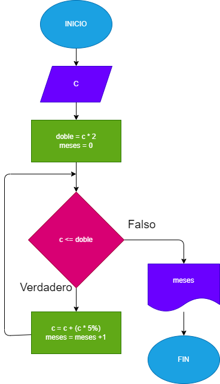
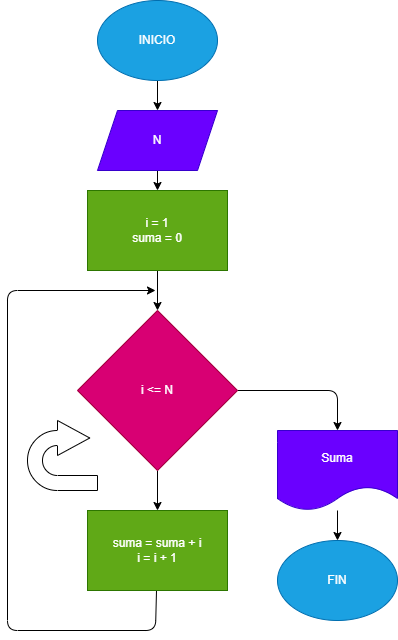

# Problema No. 14

Hacer el diagrama de flujo y el programa en python que lean un capital C y que averigue e imprima en cuantos meses se duplica, si lo colocamos a un interes compuesto del 5% mensual.

## Diagrama

# Problema No.15

Hacer el diagrama de flujo y el programa en python que lea un número y me sume los primeros números del mismo número

## Diagrama

